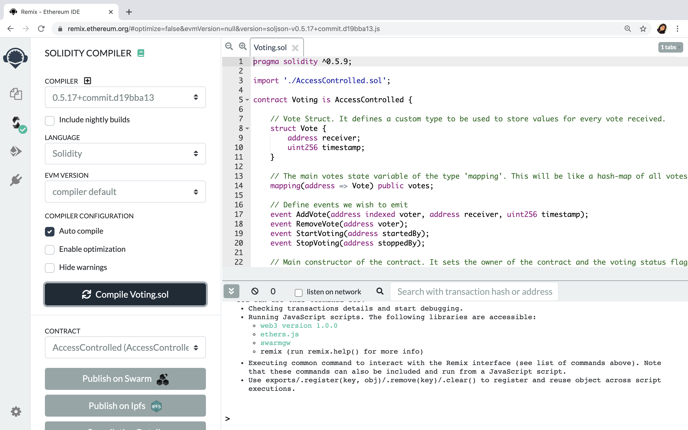
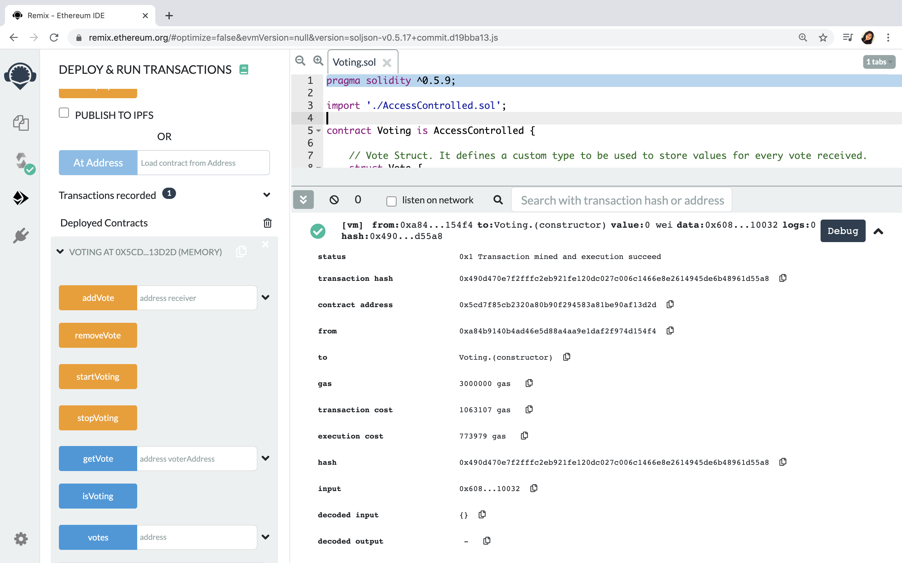
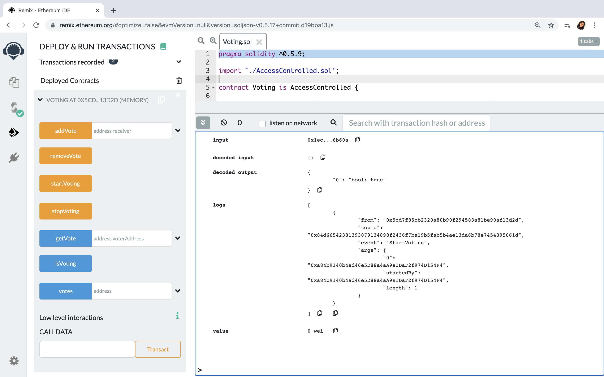
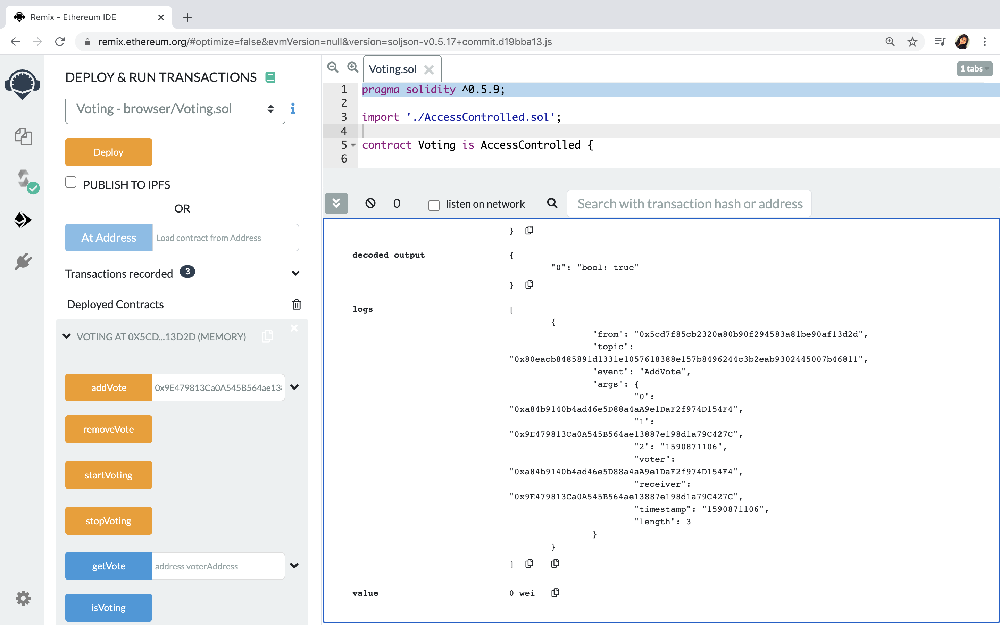
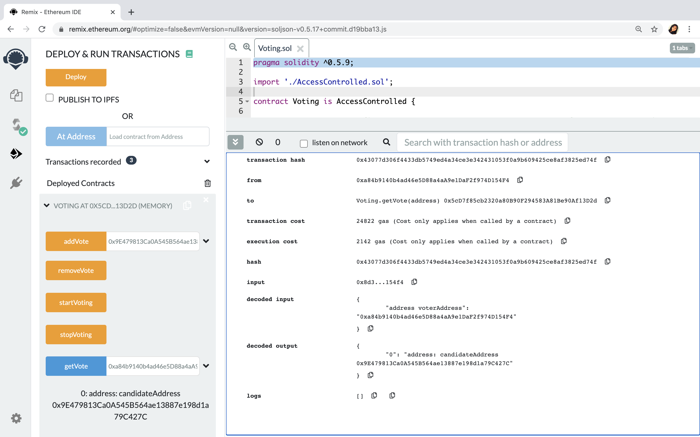
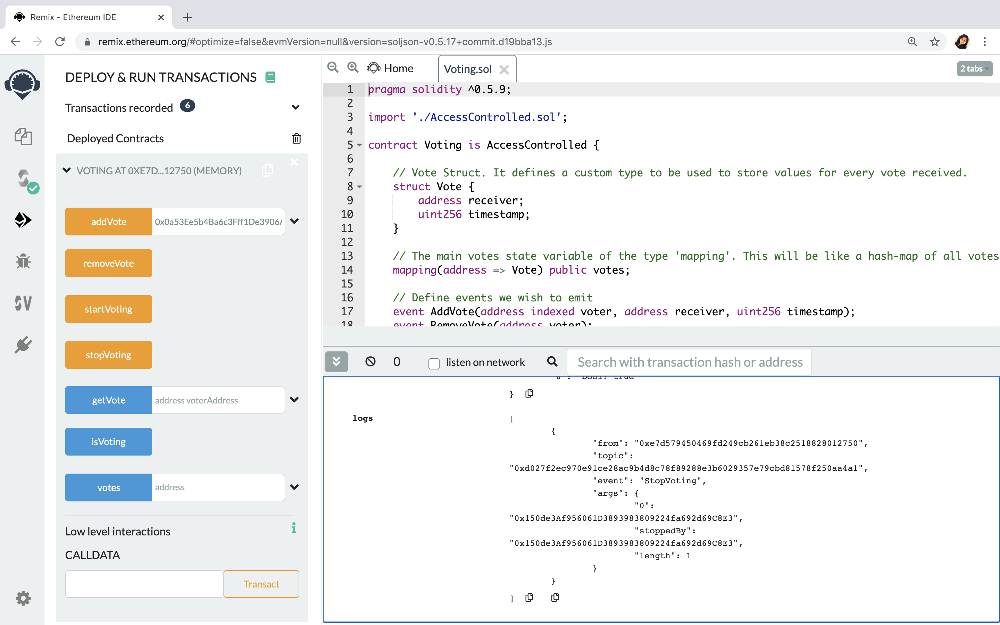

# Voting Smart Contract

## Creating a smart contract to digitalise the election process using Blockchain. ##

All the members of the organisation are part of the private blockchain and any member can vote for any other member in the organisation. 

Smart contract in this project can perform the following functionalities:

1.	Start the voting process. 
2.	Stop the voting process.
3.	Any user/member can add a new vote.
4.	Any user/member can delete their vote.
5.	Anyone in the organisation can view who a particular person has voted for.

### The folder structure of the project is as follows - ###
-	`smart-contract` - contains the smart contract Solidity files.
-	`votingethereumprivatenetwork` - contains the genesis block creation details for the network.
-	`votingtruffleproject` - contains the migration scripts, smart contracts and network configuration file(`truffle-config.js`).

The smart contracts are written in ***Solidity programming language.*** The development and deployment of the voting solidity smart contracts will follow the below stages - 

1.	Deployment and Testing of Smart Contracts in Remix environment.
2.	Setting Up a Private Ethereum Blockchain.
3.	Deploying Smart Contracts on a Private Blockchain using Truffle.
4.	Testing the Smart Contracts on Private Blockchain.

### 1.	Deployment and Testing of Smart Contracts in Remix environment ###

Compile the contract code, and then deploy and run the Contract on a sample blockchain inside the **Remix** (remix.ethereum.org) environment. If there are no syntactical error the Solidity Compiler will compile the file and shows a check mark on it's icon.

**Deploy and Run Transactions**
The smart contracts has now been deployed. When you deploy the smart contract that is a contract creation transaction. We can see the logs of this transaction in the Remix console. As you can see the below snapshot the console of the Remix environment shows the receipt of the transaction. Whenever a transaction is executed, committed, mined and put on to the blockhain as a block the receipt will be issued by the blockchain.

You can see that the smart contract is deployed at a particular address. When you click the arrow button you can also see the various functions that you have written as part of your smart contract. Remix will provide a easy to use user interface where it lists down all of the funtions as clickable buttons.

If a function takes input parameters that will be available as an input field next to that function button. For those functions which does not require the input parameter you can just click the button to exexute that function. This is how the transactions will be deployed on to the Blockchain in Remix environment.

**Invoking functions that we have defined as part of the smart contract.**

***Start the voting process -***
Function startVoting triggers an event StartVoting, beacuse of that as part of the logs now additional log will get created because of the trigger. The log contains topic,name of the event, various arguments that is passed as part of the event definition.

***Any user/member can add a new vote -***
Pass in an input parameter which will be the address of the account which you want to vote for. Choose a sample address from the dropdown addresses and pass that as a parameter to the addVote function.

***Anyone in the organisation can view who a particular person has voted for -***
Pass in an input parameter which is the address of the account to see the for the account address which the input address has voted for.

***Any user/member can delete their vote -***
Will remove the vote given by the currently selected account.

***Stop the voting process -***
stopVoting - Will stop the voting process

### 2.	Setting Up a Private Ethereum Blockchain. ###
An Ethereum network is a blockchain built of multiple nodes. These nodes can exist anywhere in the world. Together, they constitute an Ethereum network.There are multiple such Ethereum networks; they are independent of each other, and anyone can create their own private Ethereum network. They are defined or identified by a unique parameter called Chain ID.

To connect to a network, you need to be aware of the chain ID of that network because you can only refer to the network using the network's unique chain ID. After this, you need to become a node for that network. For this, you need to download an Ethereum client on your machine and then connect to the network through that. This is important because you can only connect to a network as an Ethereum client. 

***A.	The `genesis.json` file present in the `votingethereumprivatenetwork` contains all the information needed to create a genesis block for the blockchain network. Run the below command inside `votingethereumprivatenetwork`. This command will create a private chain data for  blockchain.***

>	geth --datadir ./datadir init ./genesis.json

The above command will generate the datadir folder.

***B.	Start geth client console using below command -***

>	geth --datadir ./datadir/ --networkid 2002 --rpc --rpcport 8545 --allow-insecure-unlock console

2002 is our network id and port is 8545.

***C.	Create eth accounts using below api’s , I have created 2 eth accounts with passwords set as below -***

>	personal.newAccount("account1")
>	personal.newAccount("account2")

***D.	Start the mining process using the below command and keep the mining process running as we have to deploy Voting.sol on to this network.***

>	miner.start()

### 3.	Deploying Smart Contracts on a Private Blockchain using Truffle ###

Truffle's local development environment. Using Truffle, you will compile, deploy and test the voting smart contracts on the Geth client. Once you have deployed a smart contract on a Geth client, the contract is available to the entire network.

`contracts` folder inside `mytruffleproject` contains the copy of the Voting solidity file. `migrations` folder contains the migration script for voting smart contract. `truffle-config.js` file contains the network property settings.

A.	Compile the contract using the below command

>	truffle compile

B.	After the successful compilation, migrate the contract to geth

>	truffle migrate –network geth

C.	After successfully migrating contract, open truffle console using below command

>	truffle console –network geth

D.	When truffle console opens, get the instance of contract using below command

>	let voting = await Voting.deployed()

`voting` instance will have all the methods that was defined in sol file.

